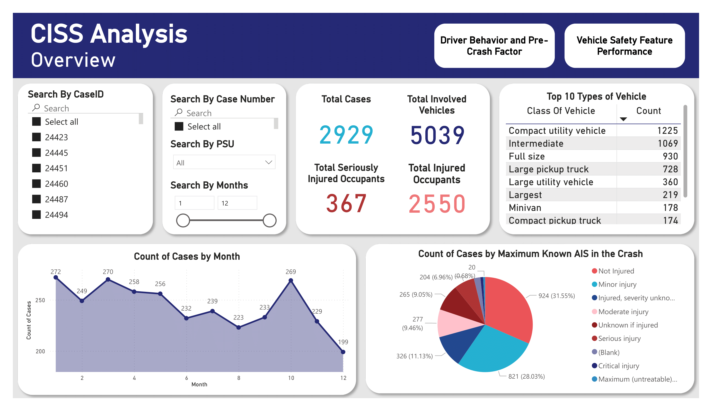
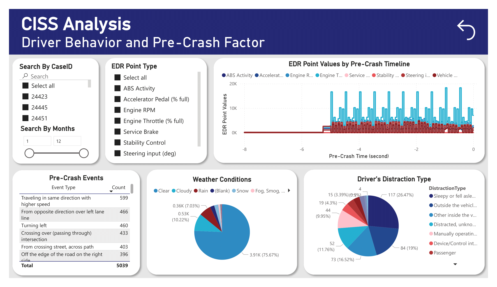
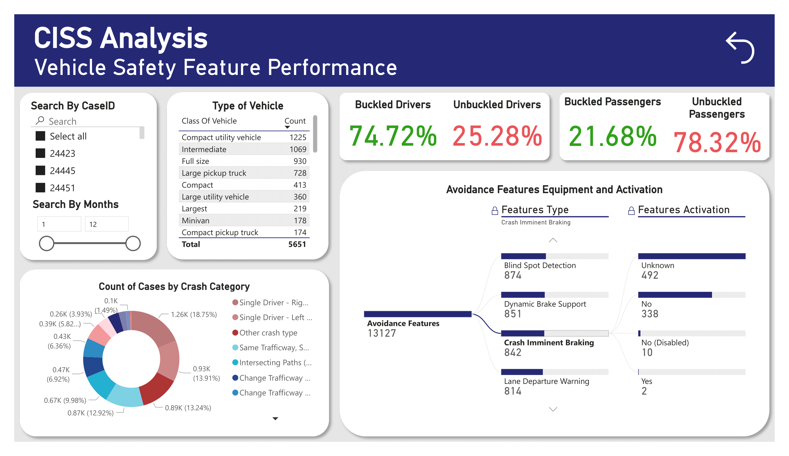

# CISS Dashboard

## Overview

The **CISS Dashboard** is an interactive web application designed to analyze data from the Crash Investigation Sampling System (CISS). The application visualizes various crash-related statistics and provides insight into vehicle safety features, driver behavior, and pre-crash factors. The dashboard is hosted on AWS Amplify and built using modern web technologies.

### Key Features:

- **Search and Filter Options**: Users can filter crash data based on CaseID, Case Number, PSU, and Month.
- **Interactive Visualizations**: Displays total cases, involved vehicles, injured occupants, and vehicle types.
- **Crash Severity Analysis**: Shows the number of cases categorized by injury severity using the AIS injury scale.
- **Driver and Vehicle Data**: Visualizes driver behavior, pre-crash factors, and vehicle safety feature performance.
  
The data-driven insights help inform safety regulations and enhance vehicle safety features.

---

## Power BI Dashboards

### 1. **CISS Analysis - Overview**
   
   - **Total Cases**: Displays the total number of crash cases and involved vehicles.
   - **Injury Data**: Shows the total number of seriously injured and total injured occupants.
   - **Vehicle Type Analysis**: Highlights the top 10 vehicle types involved in crashes.
   - **Crash Severity**: Pie charts categorize crash severity based on the AIS injury scale.
   - **Monthly Breakdown**: Line charts present crash case counts by month.

### 2. **Driver Behavior and Pre-Crash Factor**
   
   - **EDR Point Analysis**: Analyzes key vehicle and driver behavior metrics such as ABS activity, engine throttle, and steering input during pre-crash moments.
   - **Pre-Crash Events**: Presents statistics on common crash scenarios like lane changes or intersections.
   - **Weather Conditions**: Pie chart visualizes the weather conditions present during crashes.
   - **Driver Distraction Types**: Highlights the types of distractions contributing to crashes.

### 3. **Vehicle Safety Feature Performance**
   
   - **Buckled vs. Unbuckled Occupants**: Displays the percentage of drivers and passengers who were buckled/unbuckled.
   - **Avoidance Features**: Shows activation data for key safety features like Blind Spot Detection, Crash Imminent Braking, and Lane Departure Warning.
   - **Crash Category Breakdown**: Pie chart categorizes crashes based on types such as single driver crashes, intersecting paths, and trafficway changes.

---

## Project Structure

- **src/**: Contains the source code for the dashboard application, likely built with JavaScript/React.
- **public/**: Contains static assets such as images and HTML files.
- **QR_generator/**: Contains a QR code generator functionality, potentially for linking crash reports or case information.
- **.vscode/**: Visual Studio Code workspace settings.
- **package.json**: Lists dependencies and scripts for managing the project using Node.js.
- **yarn.lock** and **package-lock.json**: Dependency locks for the project, ensuring consistent builds.

---

## Installation and Setup

### Prerequisites

- Node.js installed on your machine.
- Yarn or npm for package management.

### Installation

1. Clone the repository:
   ```bash
   git clone https://github.com/your-username/CISS_dashboard.git
   ```

2. Navigate to the project directory:
    ```bash
    cd CISS_dashboard
    ```

3. Install dependencies:
    ```bash
    npm install 
    ```

4. Run the project:
    ```bash
    npm start
    ```

5. Open your browser and go to `http://localhost:3000` to view the dashboard.

## Deployment

The dashboard is hosted on **AWS Amplify.** For deploying updates:

1. Make changes to the code in the `src/` directory.
2. Push the changes to your repository:
    ```bash
    git add .
    git commit -m "Update dashboard"
    git push origin main
    ```
3. AWS Amplify will automatically build and deploy the changes.

## License

This project is licensed under the [MIT License](./LICENSE).

---

## Contact

For any inquiries or issues, please reach out to the project maintainer at [sittiwatd44@gmail.com](mailto:sittiwatd44@gmail.com).
